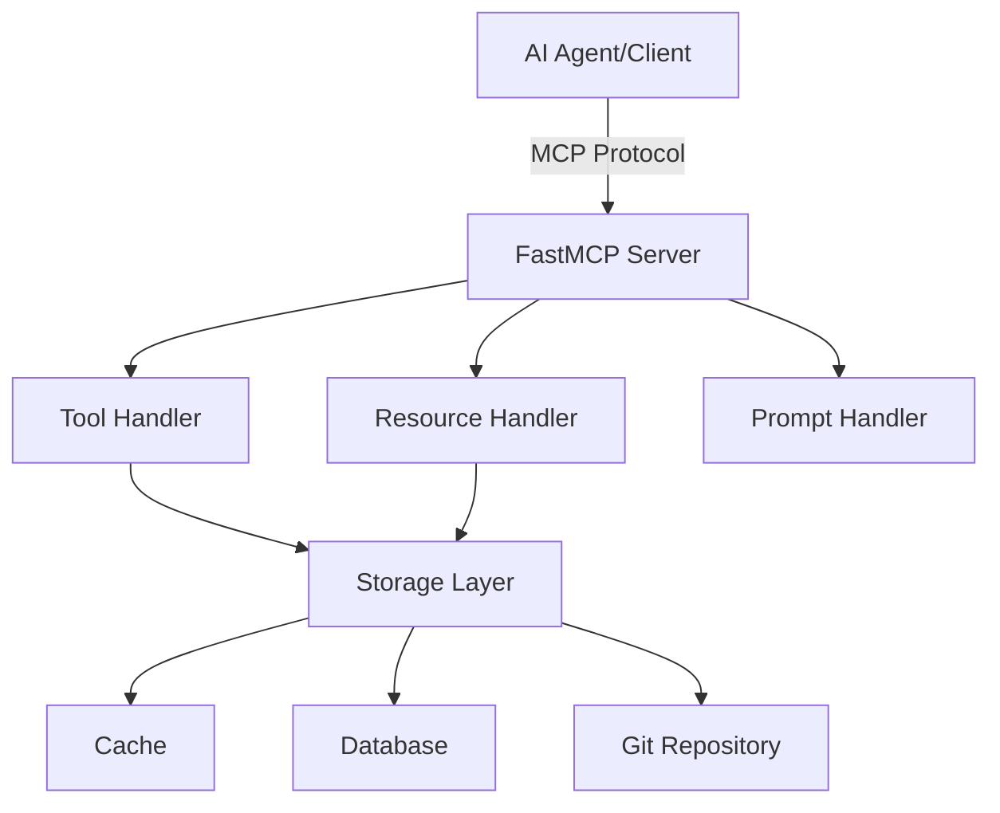

## Overview

This document outlines the Product Requirements Document (PRD) for an MCP Server for Agent Rules. The goal is to provide a Model Context Protocol (MCP) server that enables LLMs to access and manage agent rules (cursor rules and .mdc files) through standardized tools and resources.

---

## Context & Rationale

- **Purpose:** To implement an MCP server that provides tools and resources for LLMs to interact with cursor rules (.cursorrules and .mdc files) following the Model Context Protocol standards.
- **Problems Solved:**
  - Standardized access to cursor rules through MCP tools and resources
  - Efficient rule management with persistent storage and caching
  - Structured rule format with metadata headers
  - Secure and controlled access to rule operations
- **Stakeholders:** AI agents, developers, and teams working with MCP systems requiring rule management capabilities.

---

## Goals & Success Metrics

- **MCP Capabilities:**

  - **Resources:**
    - Rule content access
    - Rule metadata access
    - Rule search results
  - **Tools:**

    - **smart_fetch:** Advanced rule retrieval tool

      - Input: Array of search tags
      - Purpose: Intelligently fetch the most relevant rules based on search criteria
      - Returns: Optimized set of rules including:
        - One .cursorrules file (base rules)
        - Multiple project-specific rules (.mdc) based on relevance scoring
      - Features:
        - Tag-based matching
        - Relevance scoring algorithm
        - Context-aware rule selection
        - Optimal rule set composition

    - **find_rules:** Basic rule search tool

      - Input: Search criteria (name, type, tags)
      - Purpose: Direct lookup of rules matching specific criteria
      - Returns: All rules matching the exact search criteria

    - **list_rules:** Rule enumeration tool

      - Input: Optional filters (domain, tags)
      - Purpose: List available rules with optional filtering
      - Returns: Filtered list of rules with metadata

    - **add_rules:** Rule creation tool

      - Input: Rule content and metadata
      - Purpose: Create new rules in the system
      - Returns: Creation confirmation and rule ID

    - **update_rules:** Rule modification tool

      - Input: Rule ID and updated content/metadata
      - Purpose: Modify existing rules
      - Returns: Update confirmation

    - **remove_rules:** Rule deletion tool

      - Input: Rule ID
      - Purpose: Remove rules from the system
      - Returns: Deletion confirmation

    - **compose_rules:** Rule combination tool
      - Input: Array of rule IDs
      - Purpose: Intelligently combine multiple rules
      - Returns: Composed rule set with conflict resolution

  - **Prompts:**
    - Rule creation templates
    - Rule usage guidelines
    - Rule management instructions

- **Performance:** Optimize for low latency responses through efficient caching and storage
- **Reliability:** Ensure consistent rule access and management with proper error handling
- **Security:** Implement MCP-compliant authentication and authorization

---

## Use Cases

- **AI Agent Query:** An AI agent uses MCP tools to find and access relevant rules
- **Rule Management:** Authorized users manage rules through MCP tools
- **Rule Composition:** AI agents combine multiple rules using MCP tools
- **Rule Discovery:** Users and agents explore available rules through MCP resources

---

## Requirements

### Technical Requirements

- **FastMCP Framework:** Build the server using FastMCP as the base framework
- **MCP Compliance:** Follow Model Context Protocol standards for all capabilities
- **API Implementation:**
  - Implement standard MCP tool interfaces
  - Provide resource endpoints following MCP specifications
  - Create prompt templates following MCP guidelines

### Functional Requirements

- **Rule Structure:**
  - Metadata header (JSON/YAML)
  - Content section
  - Validation schema
- **Storage Layer:**
  - Persistent storage for rules
  - Caching mechanism
  - Version control integration
- **Security:**
  - MCP-compliant authentication
  - Role-based access control
  - Audit logging

---

## Architecture & Technical Design

### Technology Stack

- **Framework:** FastMCP
- **Language:** TypeScript
- **Storage:** PostgreSQL
- **Caching:** Redis
- **Version Control:** Git integration

### High-Level Architecture



### MCP Implementation Details

- **Tools:**
  - Implement as FastMCP tool classes
  - Follow MCP tool schema
  - Include parameter validation
- **Resources:**
  - Implement as FastMCP resources
  - Support streaming for large rules
  - Include metadata endpoints
- **Prompts:**
  - Create reusable templates
  - Include context management
  - Support dynamic variables

---

## Testing Strategy

### Testing Framework & Tools

- **Primary Framework:** Jest
  - Chosen for its robust feature set and TypeScript support
  - Excellent mocking capabilities
  - Built-in code coverage reporting
  - Parallel test execution

### Testing Levels

1. **Unit Testing**

   - **Isolation:**
     - Use Jest's mocking system for dependencies
     - Implement test doubles (mocks, stubs, spies)
     - Use test containers for PostgreSQL isolation
   - **Coverage Requirements:**
     - Minimum 80% code coverage
     - 100% coverage for critical paths (smart_fetch, rule composition)
   - **Key Areas:**
     - Tool parameter validation
     - Rule relevance scoring algorithms
     - Cache operations
     - Data transformations

2. **Integration Testing**

   - **Component Integration:**
     - Tool-to-database interactions
     - Cache-to-storage synchronization
     - MCP protocol compliance
   - **Testing Scope:**
     - End-to-end tool execution
     - Resource streaming
     - Authentication flows
     - Cache invalidation

3. **Behavior Testing**
   - **Approach:**
     - Behavior-Driven Development (BDD) style
     - Given-When-Then scenario structure
   - **Focus Areas:**
     - Rule management workflows
     - Search and retrieval scenarios
     - Error handling behaviors
     - Edge cases and boundary conditions

### Testing Strategies

1. **Tool Testing:**

   ```typescript
   describe("smart_fetch", () => {
     let testDb: TestContainer;

     beforeAll(async () => {
       testDb = await initializeTestPostgres();
     });

     afterAll(async () => {
       await testDb.stop();
     });

     it("should return one .cursorrules and relevant .mdc files", async () => {
       // Given: A set of tags and existing rules
       // When: smart_fetch is called
       // Then: Verify correct rule set composition
     });
   });
   ```

2. **Resource Testing:**

   - Mock streaming responses
   - Test partial content delivery
   - Verify metadata accuracy

3. **Performance Testing:**
   - Response time benchmarks
   - Cache hit ratio measurements
   - Load testing scenarios

### Test Organization

```plaintext
tests/
├── unit/
│   ├── tools/
│   ├── resources/
│   └── prompts/
├── integration/
│   ├── tool-chains/
│   ├── storage/
│   └── caching/
└── behavior/
    ├── scenarios/
    └── workflows/
```

### Quality Gates

1. **Pre-commit:**

   - Unit tests pass
   - Linting checks
   - Type checking

2. **Pre-merge:**

   - All tests pass
   - Coverage thresholds met
   - Integration tests pass

3. **Release:**
   - Performance benchmarks met
   - Security tests pass
   - Documentation updated

### Continuous Testing

- **CI Pipeline Integration:**

  - Automated test execution
  - Coverage reporting
  - Performance regression detection

- **Test Data Management:**
  - Fixtures for common scenarios
  - Seeded test databases
  - Mock data generators

---

## Development Phases

1. **Foundation (Story 1)**

   - FastMCP server setup with TypeScript
   - Basic MCP tool implementation
   - PostgreSQL integration

2. **Core Features (Story 2)**

   - Complete tool implementation
   - Resource endpoints
   - Basic security

3. **Enhancement (Story 3)**

   - Caching implementation
   - Advanced security
   - Prompt templates

4. **Production Ready (Story 4)**
   - Performance optimization
   - Documentation
   - Testing and validation

---

## Open Questions

- What authentication mechanism should be used for AI agents?
- How should rule versioning be handled?
- What metrics should be collected for monitoring?
- How should rule conflicts be resolved?

---

## References

- [Model Context Protocol Documentation](https://modelcontextprotocol.io/introduction)
- [FastMCP Repository](https://github.com/punkpeye/fastmcp)
- [MCP Server Development Guidelines](@mcp-server-development.mdc)
