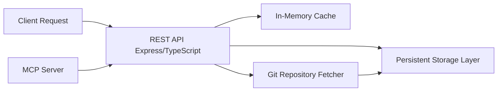

## Overview

This document outlines the Product Requirements Document (PRD) for the MCP Server for Agent Rules. The goal is to provide a highly available, performant server for managing agent rules (cursor rules and .mdc files) using a persistent storage layer combined with effective caching and fast CRUD operations.

---

## Context & Rationale

- **Purpose:** To enable the efficient fetch, storage, and management of cursor rules, which include .cursorrules and .mdc files, sourced from git repositories. This system aims to provide fast access while reducing network overhead through local persistent storage and caching.
- **Problems Solved:**
  - Elimination of full fetches at every startup through a persistent storage layer.
  - Improved performance in CRUD operations via in-memory caching and indexing.
  - Standardization of rule formatting with a structured header (in JSON/XML) combined with rule content.
- **Stakeholders:** Developers and teams working with MCP systems and agents requiring reliable rule management.

---

## Goals & Success Metrics

- **API Functionality:** Provide RESTful endpoints for the following operations:

  - find_rules
  - list_rules (filterable by domain and tags)
  - add_rules
  - update_rules
  - remove_rules
  - compose_rules

- **Performance:** Achieve low latency responses with optimized in-memory caching and efficient persistent storage to handle high request throughput.
- **Reliability:** Ensure persistent storage prevents full data fetches at startup, supporting a robust and fault-tolerant architecture.
- **Security:** Implement strict input validation, authentication, and logging for all endpoints.

---

## Use Cases

- **Developer Query:** A developer queries the server to find rules by specific IDs or tags.
- **Rule Modification:** An admin or automated process adds or updates a rule file with the correct header and content format.
- **Rule Aggregation:** A system composes multiple rules into a single configuration for agent consumption.

---

## Requirements

- **API Endpoints:** Develop endpoints corresponding to find_rules, list_rules, add_rules, update_rules, remove_rules, and compose_rules.
- **Rule File Structure:** Each rule file contains a header (in JSON or XML) with fields such as name (ID), type, description, tags, and priority, followed by a separator and the actual rule content.
- **Persistent Storage:** Integrate a persistent storage layer (e.g., SQLite, PostgreSQL, or a lightweight embedded database) to cache rules and reduce dependency on remote git repositories.
- **Caching & Indexing:** Implement in-memory caching (e.g., using Redis or in-process caches) to achieve sub-millisecond access for frequent queries.
- **Performance:** Prioritize high throughput and low latency responses through efficient indexing strategies and optimized I/O operations.
- **Security:** Enforce input validation, proper authorization, and detailed logging to safeguard access and modifications.

---

## Architecture & Key Technical Decisions

### Technology Stack

- **Backend:** Node.js with Express framework, written in TypeScript to ensure type safety and maintainability.
- **Storage:** Use a hybrid approach with a persistent database for durability combined with an in-memory caching layer for rapid access.
- **Git Integration:** Utilize Node.js libraries to interact with git repositories to fetch rule files when necessary.
- **MCP Protocol Adherence:** Follow principles and guidelines outlined in the official MCP documentation and the provided @mcp-server-development.mdc file.

### High-Level Architecture Diagram

### Performance Considerations

- **Efficient Querying:** Index rules by ID, tags, and domains to expedite searches.
- **Caching Strategy:** Use a robust in-memory cache layered on persistent data to minimize disk I/O and remote fetches.
- **Scalability:** Design the system to scale horizontally, with load balancing and potential distribution of the caching layer.

---

## Timeline & Development Phases

- **Phase 1:** Develop the core REST endpoints and integrate with the persistent storage layer.
- **Phase 2:** Implement in-memory caching and optimize indexing strategies, including interaction with git repositories.
- **Phase 3:** Enhance security measures, deploy performance tests, and ensure at least 80% unit test coverage for each subtask.

---

## Open Questions

- Which persistent storage technology (SQLite, PostgreSQL, or another option) best fits our needs?
- What are the expected production load characteristics in terms of rule access and modifications?
- How should authentication and authorization be implemented for admin and user-specific API endpoints?
- What detailed metrics should be monitored to ensure performance objectives are met?

---

## References

- [HashiCorp PRD Template](https://works.hashicorp.com/articles/prd-template)
- [RocketBlocks PRD Guidelines](https://www.rocketblocks.me/blog/what-is-a-prd.php)
- [MCP Protocol Documentation](https://modelcontextprotocol.io/introduction)
- [MCP Server Development Guidelines](@mcp-server-development.mdc)
