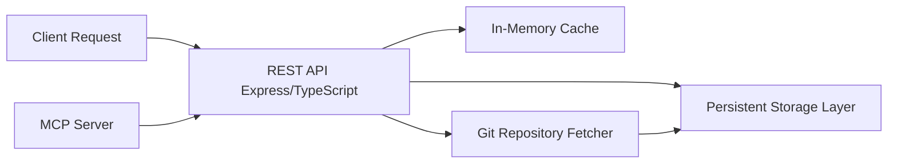

# MCP Cursor Rules Server

A high-performance Model Context Protocol (MCP) server for managing agent rules, built with TypeScript and Node.js. This server provides efficient storage, retrieval, and management of cursor rules (`.cursorrules` and `.mdc` files) with persistent storage and caching capabilities.

## Features

- FastMCP-based server implementation
- PostgreSQL integration for rule storage
- Smart rule fetching with relevance scoring
- TypeScript support
- Comprehensive test coverage

## Prerequisites

- Node.js (v16 or higher)
- PostgreSQL (v12 or higher)
- npm or yarn

## Setup

1. Clone the repository:

   ```bash
   git clone https://github.com/yourusername/mcp-cursor-rules.git
   cd mcp-cursor-rules
   ```

2. Install dependencies:

   ```bash
   npm install
   ```

3. Set up environment variables:
   Create a `.env` file in the root directory with the following content:

   ```env
   POSTGRES_USER=postgres
   POSTGRES_PASSWORD=postgres
   POSTGRES_HOST=localhost
   POSTGRES_PORT=5432
   POSTGRES_DB=mcp_rules
   ```

4. Create the database:

   ```bash
   createdb mcp_rules
   ```

5. Build the project:
   ```bash
   npm run build
   ```

## Running Tests

Run the test suite:

```bash
npm test
```

Run tests with coverage:

```bash
npm run test:coverage
```

## Running the Server

Start the server in development mode:

```bash
npm run dev
```

Start the server in production mode:

```bash
npm start
```

## Available Tools

### smart_fetch

Intelligently fetches the most relevant rules based on search criteria.

Parameters:

- `tags`: Array of strings representing search tags

Returns:

- `cursorrules`: Base cursor rules file
- `mdcFiles`: Array of relevant MDC files with relevance scores

## Contributing

1. Fork the repository
2. Create your feature branch (`git checkout -b feature/amazing-feature`)
3. Commit your changes (`git commit -m 'Add some amazing feature'`)
4. Push to the branch (`git push origin feature/amazing-feature`)
5. Open a Pull Request

## License

This project is licensed under the ISC License.

## Client Integration

### Claude Desktop and Other MCP Clients

Add the following configuration to your MCP client's configuration file:

```json
{
  "mcpServers": {
    "cursor-rules": {
      "command": "npx",
      "args": ["-y", "@nazruden/mcp-cursor-rules"]
    }
  }
}
```

That's it! The MCP client will automatically:

1. Install the server package if not present
2. Start the server when needed
3. Handle all communication with the server

### Available Commands

You can also run the server directly using npm:

```bash
# Using npx (recommended)
npx @nazruden/mcp-cursor-rules

# Or after installing globally
npm install -g @nazruden/mcp-cursor-rules
mcp-cursor-rules
```

## MCP Capabilities

### Resources

- `rules`: Access and manage cursor rules stored in the server
  - Methods: GET, LIST
  - Supports filtering by domain and tags

### Tools

1. **find_rules**

   - Find specific rules by ID or tags
   - Parameters:
     - `query`: string (search query)
     - `tags`: string[] (filter by tags)

2. **compose_rules**

   - Combine multiple rules into a single configuration
   - Parameters:
     - `rule_ids`: string[] (IDs of rules to compose)

3. **update_rules**

   - Update existing rules with new content
   - Parameters:
     - `id`: string (rule ID)
     - `content`: string (new rule content)

4. **delete_rules**
   - Remove rules from the server
   - Parameters:
     - `id`: string (rule ID)

## Features

- **Fast Rule Management**: Efficient CRUD operations for cursor rules with sub-millisecond access times
- **Persistent Storage**: Durable storage layer to eliminate full fetches at startup
- **In-Memory Caching**: Optimized caching for high-throughput performance
- **Git Integration**: Seamless integration with git repositories for rule sourcing
- **RESTful API**: Clean and well-documented endpoints for rule management
- **Type Safety**: Built with TypeScript for enhanced reliability and maintainability

## API Endpoints

- `GET /rules` - List all rules (filterable by domain and tags)
- `GET /rules/:id` - Find specific rules by ID
- `POST /rules` - Add new rules
- `PUT /rules/:id` - Update existing rules
- `DELETE /rules/:id` - Remove rules
- `POST /rules/compose` - Compose multiple rules into a single configuration

## Getting Started

### Prerequisites

- Node.js (v18 or higher)
- npm or yarn
- Git

### Installation

1. Clone the repository:

```bash
git clone [repository-url]
cd mcp-cursor-rules
```

2. Install dependencies:

```bash
npm install
```

3. Set up environment variables:

```bash
cp .env.example .env
# Edit .env with your configuration
```

4. Start the server:

```bash
npm run start
```

For development:

```bash
npm run dev
```

### Running Tests

The project maintains high test coverage (>80%) for reliability:

```bash
# Run unit tests
npm run test

# Run tests with coverage
npm run test:coverage
```

## Architecture



## Rule File Structure

Each rule file contains:

- Header (JSON/XML) with metadata (name, type, description, tags, priority)
- Content separator
- Rule content

Example:

```
{
  "name": "typescript-style",
  "type": "coding-standard",
  "description": "TypeScript coding standards and best practices",
  "tags": ["typescript", "style", "standards"],
  "priority": 1
}
---
# TypeScript Style Guide
[rule content here]
```

## Contributing

1. Fork the repository
2. Create your feature branch (`git checkout -b feature/amazing-feature`)
3. Commit your changes (`git commit -m 'Add amazing feature'`)
4. Push to the branch (`git push origin feature/amazing-feature`)
5. Open a Pull Request

## License

This project is licensed under the MIT License - see the [LICENSE](LICENSE) file for details.

## Built With

- [Node.js](https://nodejs.org/) - Runtime environment
- [Express](https://expressjs.com/) - Web framework
- [TypeScript](https://www.typescriptlang.org/) - Programming language
- [EasyMCP](https://github.com/zcaceres/easy-mcp/) - MCP server framework

## Acknowledgments

- [Model Context Protocol](https://modelcontextprotocol.io/introduction) - MCP documentation
- [MCP Server Development Guidelines](https://modelcontextprotocol.io/quickstart/server) - Server development guidelines

## Package Publishing

### NPM Package Details

```json
{
  "name": "@nazruden/mcp-cursor-rules",
  "version": "1.0.0",
  "description": "MCP server for managing cursor rules and configurations",
  "main": "dist/index.js",
  "types": "dist/index.d.ts",
  "bin": {
    "mcp-cursor-rules": "./dist/cli.js"
  },
  "files": ["dist", "README.md", "LICENSE"],
  "publishConfig": {
    "access": "public"
  }
}
```

### Publishing Steps

1. Ensure your package.json is up to date with the above configuration
2. Build the project:

```bash
npm run build
```

3. Test the package:

```bash
npm test
```

4. Login to npm:

```bash
npm login
```

5. Publish the package:

```bash
npm publish --access public
```
